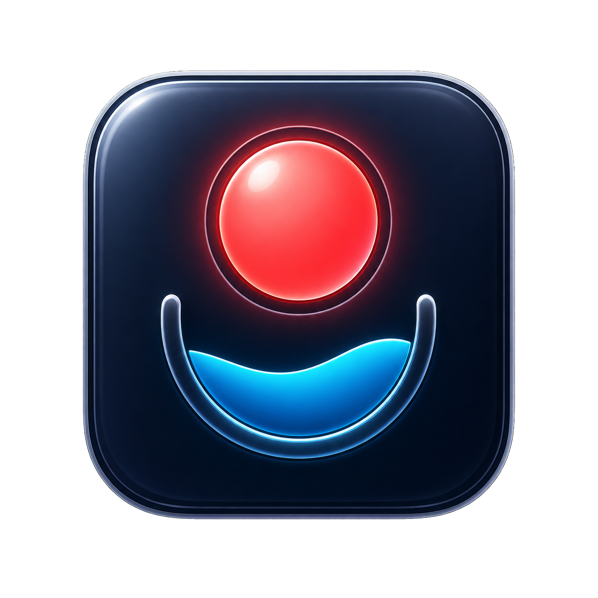
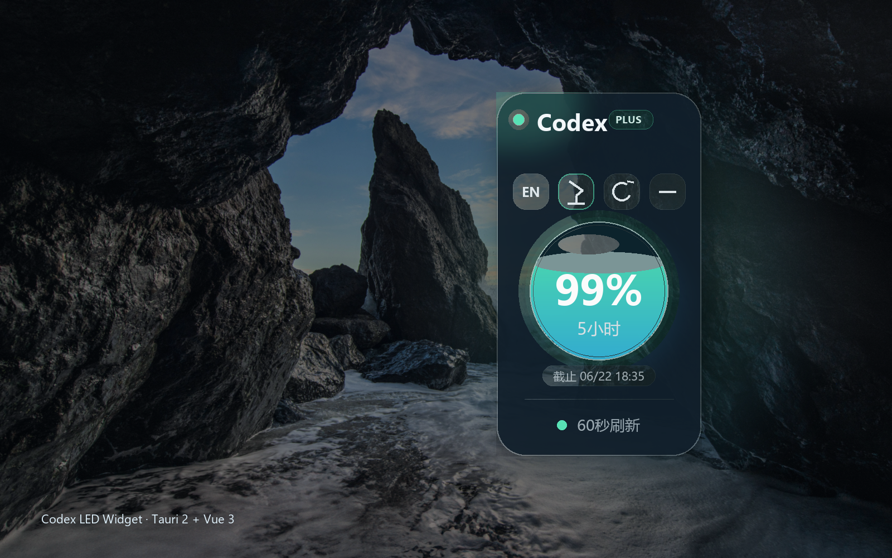
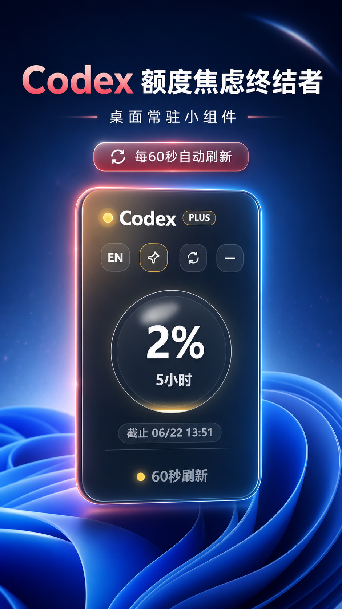

# Codex LED Widget

<p align="center">
  
</p>

<p align="center">
  <strong>Windows 桌面上的 Codex 额度悬浮状态灯。</strong><br />
  A compact Tauri desktop widget for monitoring local Codex quota.
</p>

<p align="center">
  <a href="https://github.com/Wolfares526/codex-led-widget/releases/latest">下载最新版</a>
  ·
  <a href="#功能">功能</a>
  ·
  <a href="#本地开发">本地开发</a>
  ·
  <a href="#english">English</a>
</p>

---

## 项目简介

Codex LED Widget 是一个轻量的 Windows 桌面悬浮组件。它通过本机 Codex CLI
读取当前账号的 5 小时和 7 天额度窗口，并用竖版液态玻璃状态球展示剩余百分比。

应用复用本机已有的 Codex 登录状态，不需要手动输入 API Key 或 Token。

## 截图

<p align="center">
  
</p>

<p align="center">
  
</p>

<p align="center">
  
</p>

## 功能

- 竖版透明悬浮窗口，适合贴在桌面边缘常驻
- 液态球展示当前额度窗口的剩余百分比
- 点击液态球可在 `5小时` 和 `7天` 额度窗口之间切换
- 球下方显示当前窗口的计费截止时间，精确到分钟
- 每 60 秒自动读取 Codex 额度，也可手动刷新
- 自动刷新时会同步轮换 5 小时和 7 天展示
- 绿色、黄色、红色状态提示，低额度时自动变色
- 支持置顶、隐藏、系统托盘恢复和托盘菜单
- 支持中文与 English 切换
- 兼容 Microsoft Store 版 Codex CLI

## 下载

前往 [GitHub Releases](https://github.com/Wolfares526/codex-led-widget/releases/latest)
下载 Windows x64 安装包：

- 推荐：[Codex Quota Widget_0.2.0_x64-setup.exe](https://github.com/Wolfares526/codex-led-widget/releases/download/v0.2.0/Codex.Quota.Widget_0.2.0_x64-setup.exe)
- MSI：[Codex Quota Widget_0.2.0_x64_en-US.msi](https://github.com/Wolfares526/codex-led-widget/releases/download/v0.2.0/Codex.Quota.Widget_0.2.0_x64_en-US.msi)

当前版本：`v0.2.0`

> 应用暂未进行代码签名。Windows 首次运行时可能显示“未知发布者”，请确认文件来自本仓库后选择“更多信息” -> “仍要运行”。

## 运行要求

- Windows 10 或 Windows 11 x64
- 已安装 Codex 桌面应用或 Codex CLI
- 已在本机登录 Codex

## 使用方法

1. 从 [Releases](https://github.com/Wolfares526/codex-led-widget/releases/latest) 下载 Windows 安装包。
2. 安装并启动应用，小组件默认显示在主屏幕右上角并保持置顶。
3. 使用顶部按钮切换语言、置顶状态、手动刷新或隐藏窗口。
4. 点击液态球，在 5 小时和 7 天额度窗口之间切换。
5. 隐藏后可通过系统托盘重新显示，或通过托盘菜单刷新、置顶和退出。

## 状态说明

| 状态 | 剩余额度 |
| --- | --- |
| 绿色 | 大于等于 10% |
| 黄色 | 大于 0% 且小于 10% |
| 红色 | 0% |

## 隐私

- 额度通过本机 Codex CLI 读取
- 使用本机现有 Codex 登录状态
- 不要求用户输入 API Key 或认证 Token
- 不向本项目维护者上传额度或认证数据
- Microsoft Store 版 CLI 如位于受保护目录，会复制到当前用户的本地应用缓存后运行

CLI 兼容缓存位于：

```text
%LOCALAPPDATA%\codex-led-widget\bin
```

诊断日志位于：

```text
%LOCALAPPDATA%\codex-led-widget\quota-service.log
```

日志仅记录 CLI 路径、读取成功状态和错误信息，不记录额度响应或认证信息。

## 本地开发

需要 Node.js、pnpm 和 Rust/Tauri 2 开发环境。

```powershell
git clone https://github.com/Wolfares526/codex-led-widget.git
cd codex-led-widget
pnpm install
pnpm dev
```

构建 Windows 安装包：

```powershell
pnpm build
```

只构建前端：

```powershell
pnpm build:web
```

前端产物生成在 `dist/`。Tauri 应用和安装包生成在
`src-tauri/target/release/`，这些目录不会提交到 Git。

## 项目结构

```text
codex-led-widget/
├── assets/                 # README 截图和项目图标
├── src-tauri/              # Tauri 2 Rust 后端、窗口、托盘和打包配置
├── src/
│   ├── components/         # Vue 3 界面组件
│   ├── composables/        # 额度、语言和窗口状态逻辑
│   ├── styles/             # 竖版液态玻璃界面样式
│   └── types/              # 前后端共享类型
├── package.json
└── pnpm-lock.yaml
```

## 技术栈

- Tauri 2
- Rust
- Vue 3
- TypeScript
- Vite
- pnpm

## 常见问题

### 显示“连接异常”怎么办？

确认 Codex 已安装并登录，然后点击刷新。仍然失败时，请查看：

```text
%LOCALAPPDATA%\codex-led-widget\quota-service.log
```

也可通过 `CODEX_CLI_PATH` 环境变量指定一个可执行的 `codex.exe` 路径。

### 支持 macOS 或 Linux 吗？

当前版本仅构建和测试 Windows x64。

### 为什么安装包没有代码签名？

项目当前未配置 Windows 代码签名证书，因此系统可能显示未知发布者提示。

## 贡献

欢迎提交 [Issue](https://github.com/Wolfares526/codex-led-widget/issues)
或 Pull Request。

## License

MIT

---

## English

Codex LED Widget is a compact Windows desktop widget built with Tauri 2 and Vue 3.
It reads quota information from the local Codex CLI and displays the active 5-hour
or 7-day window as a vertical liquid-glass status widget.

### Highlights

- Compact always-on-top desktop widget
- Liquid quota meter with green, yellow, and red states
- Click the orb to switch between 5-hour and 7-day quota windows
- Shows the active window cutoff time to the minute
- Automatic 60-second refresh and manual refresh
- System tray support
- Chinese and English UI
- Microsoft Store Codex CLI compatibility
- No API key or token entry required

### Development

```powershell
git clone https://github.com/Wolfares526/codex-led-widget.git
cd codex-led-widget
pnpm install
pnpm dev
```

Build:

```powershell
pnpm build
```

Frontend-only build:

```powershell
pnpm build:web
```
